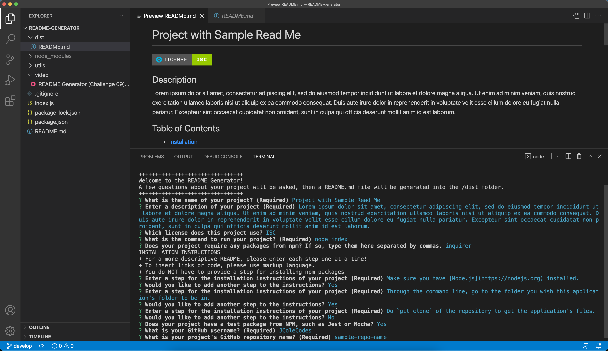

# README Generator

## Description
This README generator works through the command line by asking a series of questions. After the questions are answered, the generator takes the answers and applies it to a README.md file written in markup and output into the /dist folder.

[](https://drive.google.com/file/d/1OZJBCoJ4zxGpRGGwOCQhDA6xF90gAzRO/view?usp=sharing)

View video of the working application: [Download Local File](https://github.com/JColeCodes/README-generator-challenge-09/raw/main/video/README%20Generator%20(Challenge%2009).mp4) | [Google Drive](https://drive.google.com/file/d/1OZJBCoJ4zxGpRGGwOCQhDA6xF90gAzRO/view)

[View a sample README.md](https://github.com/JColeCodes/README-generator-challenge-09/blob/main/dist/README.md)

## Table of Contents
* [Installation](#installation)
* [Usage](#usage)
* [Contributing](#contributing)
* [Questions](#questions)

## Installation
To install this project, please follow these steps: 
1. Make sure you have [Node.js](https://nodejs.org) installed.
2. Through the command line, go to the folder you wish this application's folder to be in.
3. Do `git clone` of the repository to get the application's files.

This program requires the following packages from npm: 
* [inquirer](https://www.npmjs.com/package/inquirer)

In order to install all of them, enter the following into the command line:
```
npm install
```

## Usage
To run this project, enter the following into the command line:
```
node index
```

## Contributing
If you would like to contribute to this project, you can do so by:
1. Forking the project. ([Learn how to fork.](https://docs.github.com/en/get-started/quickstart/fork-a-repo))
2. Creating a new feature branch, committing the changes, and pushing the branch.
3. Opening a [Pull Request](https://github.com/JColeCodes/README-generator-challenge-09/pulls).

You can also check the list of [Issues](https://github.com/JColeCodes/README-generator-challenge-09/issues).

Read the [Contributor Covenant Code of Conduct](https://www.contributor-covenant.org/version/2/1/code_of_conduct/).

## Questions
README Generator was created by [JColeCodes](https://github.com/JColeCodes). For inquiries regarding the project, please email the creator at [capauldi@gmail.com](mailto:capauldi@gmail.com).